<div align="center">

# 🌄 Explainable Scene Classification with Deep ResNet & Grad-CAM

<div align="center"> 
  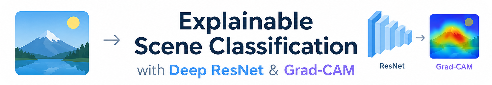 
</div>

---

[](https://www.python.org/)
[](https://tensorflow.org/)
[](https://keras.io/)
[](https://www.kaggle.com/datasets/puneet6060/intel-image-classification)
[](https://arxiv.org/abs/1610.02391)
[](https://www.tensorflow.org/tfx/guide/serving)
[](https://opensource.org/licenses/MIT)

<p align="center">
  <strong>Multi-class natural scene categorization powered by custom Residual Networks (ResNet), evaluated with Gradient-weighted Class Activation Mapping (Grad-CAM) visual explainability and served via TensorFlow Serving.</strong>
</p>

</div>

---

## 📌 Table of Contents

- [Executive Summary](#-executive-summary)
- [System Architecture & End-to-End Pipeline](#-system-architecture--end-to-end-pipeline)
- [Dataset & Exploratory Data Analysis (EDA)](#-dataset--exploratory-data-analysis-eda)
  - [Class Taxonomy & Overview](#class-taxonomy--overview)
  - [Class Distribution Analysis](#class-distribution-analysis)
  - [Data Augmentation Pipeline](#data-augmentation-pipeline)
- [Model Architecture: Deep Residual Learning](#-model-architecture-deep-residual-learning)
  - [The Vanishing Gradient Problem](#the-vanishing-gradient-problem)
  - [Residual Skip Connections](#residual-skip-connections)
  - [Layer Hierarchy & Target Convolutional Layer](#layer-hierarchy--target-convolutional-layer)
- [Training Dynamics & Performance](#-training-dynamics--performance)
- [Diagnostic Evaluation & Confusion Analysis](#-diagnostic-evaluation--confusion-analysis)
  - [Quantitative Classification Metrics](#quantitative-classification-metrics)
  - [Dual Confusion Matrix](#dual-confusion-matrix)
  - [Glacier vs. Mountain Semantic Error Breakdown](#glacier-vs-mountain-semantic-error-breakdown)
- [Explainable AI (XAI): Grad-CAM Deep Dive](#-explainable-ai-xai-grad-cam-deep-dive)
  - [Grad-CAM Mathematical Formulation](#grad-cam-mathematical-formulation)
  - [Grad-CAM Visual Gallery](#grad-cam-visual-gallery)
- [Production Model Serving (TensorFlow Serving)](#-production-model-serving-tensorflow-serving)
- [Project Directory Structure](#-project-directory-structure)
- [Quickstart & Installation](#-quickstart--installation)
  - [Prerequisites](#prerequisites)
  - [Environment Setup via UV / Pip](#environment-setup-via-uv--pip)
  - [Running the Notebook](#running-the-notebook)
- [References & Acknowledgements](#-references--acknowledgements)
- [License](#-license)

---

## 🚀 Executive Summary

Deep learning computer vision models deployed in production environments must not function as uninterpretable "black boxes". This project tackles multi-class visual recognition across six distinct natural and urban landscape environments (**Buildings**, **Forest**, **Glacier**, **Mountain**, **Sea**, and **Street**) leveraging the benchmark **Intel Scene Classification** dataset.

To ensure predictive performance and interpretability:
1. We design and train a custom **Deep Residual Network (ResNet)** that incorporates residual identity and convolutional projection blocks to combat vanishing gradients across deep hierarchies.
2. We implement **Gradient-weighted Class Activation Mapping (Grad-CAM)** to backpropagate target class gradient signals to the final convolutional feature maps (`res_5_identity_2_c`), synthesizing high-resolution activation heatmaps that highlight the exact spatial regions influencing the network's classifications.
3. We serialize and serve the trained model with **TensorFlow Serving** for production-grade, low-latency microservice inference.

<div align="center">
  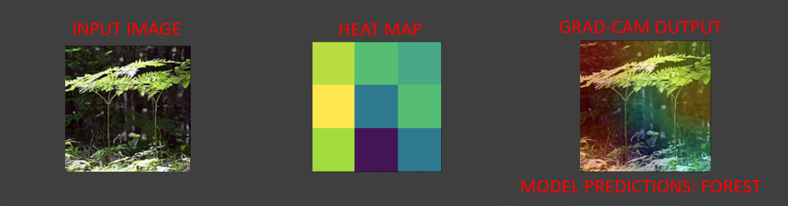
  <p><em>Figure 1: Project Overview & Core Technical Objectives.</em></p>
</div>

---

## 🔄 System Architecture & End-to-End Pipeline

The operational workflow spans data ingestion, automated augmentations, convolutional feature encoding through residual blocks, diagnostic evaluation, Grad-CAM interpretability extraction, and production deployment:

<div align="center">
  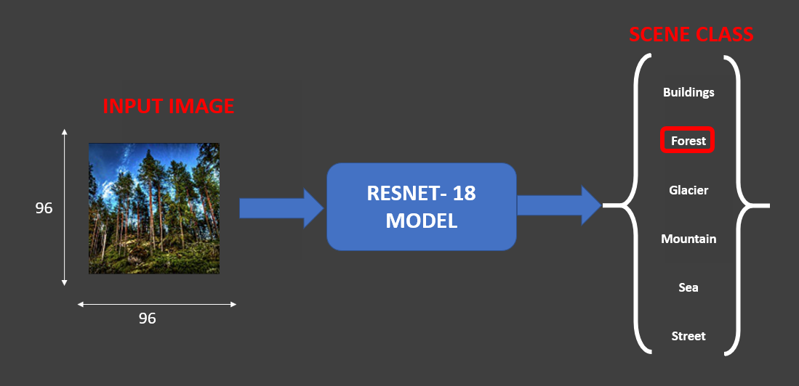
  <p><em>Figure 2: End-to-End Explainable Scene Classification & Serving Pipeline.</em></p>
</div>

1. **Ingestion & Preprocessing**: Raw RGB natural scene images are normalized into $[0, 1]$ floating-point tensors and resized to $256 \times 256 \times 3$.
2. **Dynamic Augmentation**: On-the-fly geometric shifts, random rotations, shears, and zoom transformations to improve generalization.
3. **Deep Residual Network**: Multi-stage hierarchical convolutional blocks with batch normalization, ReLU non-linearities, and shortcut projections.
4. **Diagnostic Metrics**: Multi-metric evaluation on unseen test distributions (Precision, Recall, F1-Score, Dual Confusion Matrix).
5. **Grad-CAM Interpretability Engine**: Gradient extraction with respect to penultimate convolutional feature maps, producing localization heatmaps.
6. **Production Serving**: Model serialized in `.keras`, `.hdf5`, and SavedModel formats, validated through batch inference queries via TensorFlow Serving.

---

## 📊 Dataset & Exploratory Data Analysis (EDA)

### Class Taxonomy & Overview

The project leverages the **Intel Image Classification Dataset** (~25,000 real-world scenes across 6 categories):

| Class Index | Class Name | Semantic Description | Key Visual Signatures |
| :---: | :--- | :--- | :--- |
| **0** | `buildings` | Urban architectural structures | Rectilinear edges, windows, concrete facades, geometric lines |
| **1** | `forest` | Dense tree canopies & woodlands | High-frequency organic texture, green vegetation, tree trunks |
| **2** | `glacier` | Ice masses and snow-covered terrain | Bright white/cyan spectra, ice crevasses, frozen slopes |
| **3** | `mountain` | Rock peaks and mountainous terrain | Sharp rocky ridges, brown/gray slopes, sky horizons |
| **4** | `sea` | Open ocean and coastal water bodies | Blue horizontal water gradients, wave ripples, shorelines |
| **5** | `street` | Urban roads and vehicle pathways | Asphalt lanes, cars, sidewalk borders, traffic infrastructure |

### Class Distribution Analysis

The dataset maintains balanced representation across all six categories, preventing class-frequency bias during stochastic gradient descent:

<div align="center">
  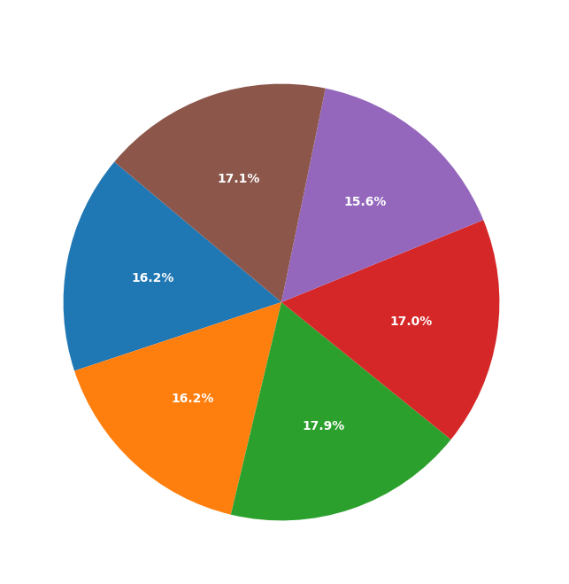
  <p><em>Figure 3: Training Dataset Class Distribution.</em></p>
</div>

On the independent test dataset, class counts are similarly verified to ensure unbiased evaluation:

<div align="center">
  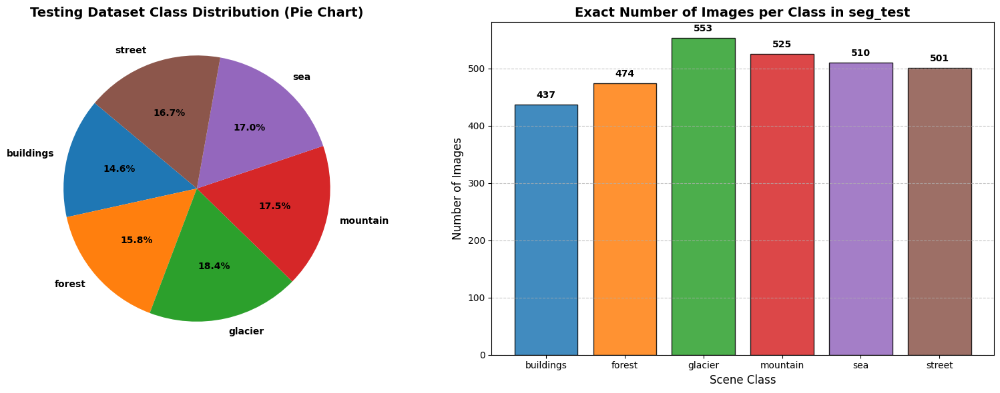
  <p><em>Figure 4: Test Dataset Distribution (Proportional Breakdown & Frequency Counts).</em></p>
</div>

### Data Augmentation Pipeline

To improve model resilience against viewpoint variations and illumination differences, a comprehensive augmentation pipeline is applied:
- **Random Rotation**: Up to $\pm 25^\circ$
- **Width & Height Shifts**: Up to $15\%$ translation
- **Shear Transformation**: Angle distortion up to $15\%$
- **Random Zoom**: Scaling within $[0.8, 1.2]$
- **Horizontal Flipping**: Mirror reflection (vertical flip disabled to preserve sky-ground orientation)

<div align="center">
  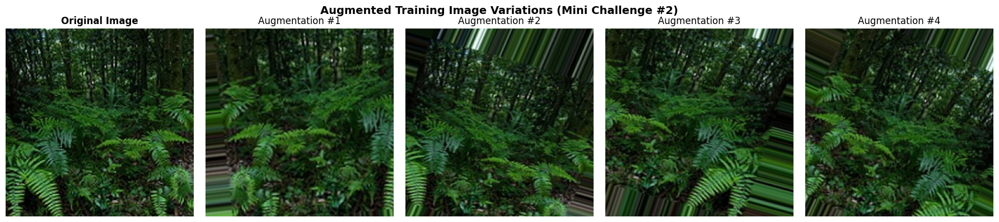
  <p><em>Figure 5: Data Augmentation Variations (Original Scene vs. Generated Variations).</em></p>
</div>

---

## 🧠 Model Architecture: Deep Residual Learning

### The Vanishing Gradient Problem

In standard deep convolutional networks, backpropagating gradients through repeated chain-rule multiplications causes exponential decay of gradient magnitudes in earlier layers:

$$\frac{\partial \mathcal{L}}{\partial W_1} = \frac{\partial \mathcal{L}}{\partial y} \cdot \prod_{l=2}^{L} \frac{\partial z_l}{\partial z_{l-1}} \cdot \frac{\partial z_1}{\partial W_1}$$

As depth $L$ grows, if $\left\| \frac{\partial z_l}{\partial z_{l-1}} \right\| < 1$, the gradient decays toward zero, halting optimization of early feature detectors.

<div align="center">
  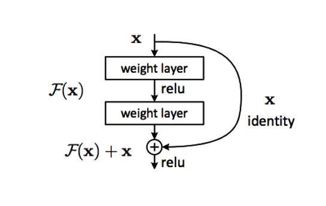
  <p><em>Figure 6: Theoretical Illustration of the Vanishing Gradient Problem in Deep Networks.</em></p>
</div>

### Residual Skip Connections

To resolve network degradation, He et al. (2015) introduced identity shortcut connections. Instead of expecting stacked layers to directly fit an underlying mapping $\mathcal{H}(x)$, the network parameterizes a residual function $\mathcal{F}(x) = \mathcal{H}(x) - x$:

$$\mathcal{H}(x) = \mathcal{F}(x, \{W_i\}) + x$$

During backpropagation, the identity pathway creates an additive gradient highway:

$$\frac{\partial \mathcal{L}}{\partial x} = \frac{\partial \mathcal{L}}{\partial \mathcal{H}} \left( \frac{\partial \mathcal{F}}{\partial x} + 1 \right)$$

Because of the $+1$ term, gradients propagate cleanly back to the earliest layers even if intermediate layer gradients $\frac{\partial \mathcal{F}}{\partial x}$ approach zero.

<div align="center">
  
  <p><em>Figure 7: Residual Block Architecture with Identity Shortcut.</em></p>
</div>

### Layer Hierarchy & Target Convolutional Layer

The network arranges residual blocks into five sequential stages, culminating in the critical convolutional layer examined by Grad-CAM:

<div align="center">
  
  <p><em>Figure 8: ResNet Stage-by-Stage Architecture Breakdown.</em></p>
</div>

- **Target Conv Layer (`res_5_identity_2_c`)**: Final `Conv2D` layer in Stage 5 with output shape `(None, 3, 3, 2048)` and $1,050,624$ parameters. It captures the richest high-level semantic representations before spatial pooling.
- **Classification Head**: `Average_Pooling` $\to$ `Flatten` $\to$ `Dense_final` (6 logits with softmax activation).

---

## 📈 Training Dynamics & Performance

The model was optimized using **Adam** with categorical cross-entropy loss:

$$\mathcal{L}_{CE} = -\sum_{c=1}^{C} y_c \log(\hat{y}_c)$$

Early stopping was configured with model checkpointing saving the best weights to `weights.keras` and `weights.hdf5`:

<!-- <div align="center">
  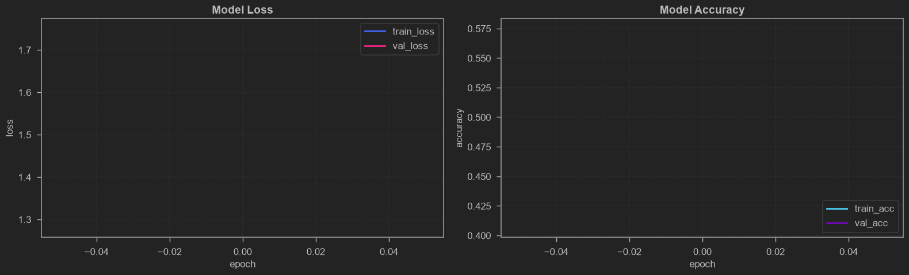
  <p><em>Figure 9: Model Training vs. Validation Loss and Accuracy Curves.</em></p>
</div> --> 

<!-- model needs to be trained (in my case as I only trained for 1 epoch to save time) -->

---

## 🔬 Diagnostic Evaluation & Confusion Analysis

### Quantitative Classification Metrics

The model was evaluated on $3,000$ unseen test images across all six classes:

| Class | Precision | Recall | F1-Score | Support |
| :--- | :---: | :---: | :---: | :---: |
| **Buildings** | $0.7198$ | $0.3410$ | $0.4627$ | 437 |
| **Forest** | **$1.0000$** | $0.3713$ | $0.5415$ | 474 |
| **Glacier** | $0.5007$ | $0.6383$ | $0.5612$ | 553 |
| **Mountain** | $0.5844$ | **$0.7257$** | **$0.6474$** | 525 |
| **Sea** | $0.5719$ | $0.7176$ | $0.6365$ | 510 |
| **Street** | $0.5742$ | $0.7106$ | $0.6351$ | 501 |
| **Overall Accuracy** | — | — | **$59.37\%$** | **$3000$** |
| **Macro Average** | $0.6585$ | $0.5841$ | $0.5808$ | $3000$ |
| **Weighted Average** | $0.6505$ | $0.5937$ | $0.5840$ | $3000$ |

> [!NOTE]
> **Forest Detection Precision**: Reached **$100.00\%$**, demonstrating that when the network predicts `forest`, it produces zero false positives.
> **Mountain & Sea Recall**: Exceeded **$71\%-72\%$**, effectively detecting dominant landscape horizons.

### Dual Confusion Matrix

To examine inter-class confusion patterns, both absolute sample counts and normalized recall percentages were computed:

<div align="center">
  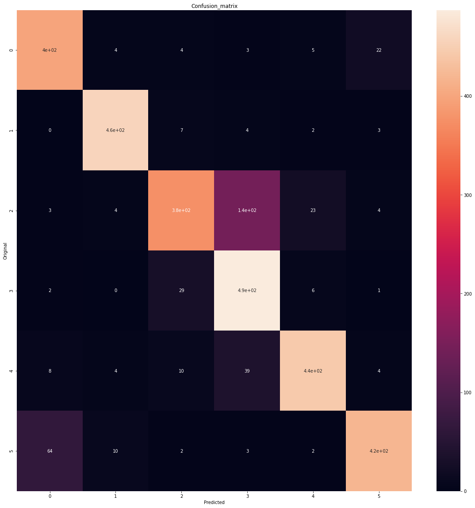
  <p><em>Figure 10: Dual Confusion Matrix — Absolute Counts (Left) & Recall Percentages (Right).</em></p>
</div>

### Glacier vs. Mountain Semantic Error Breakdown

A prominent diagnostic insight is the mutual misclassification between **Glacier** and **Mountain**:
- $17.5\%$ of true Glaciers were classified as Mountains.
- $15.8\%$ of true Mountains were classified as Glaciers.

<div align="center">
  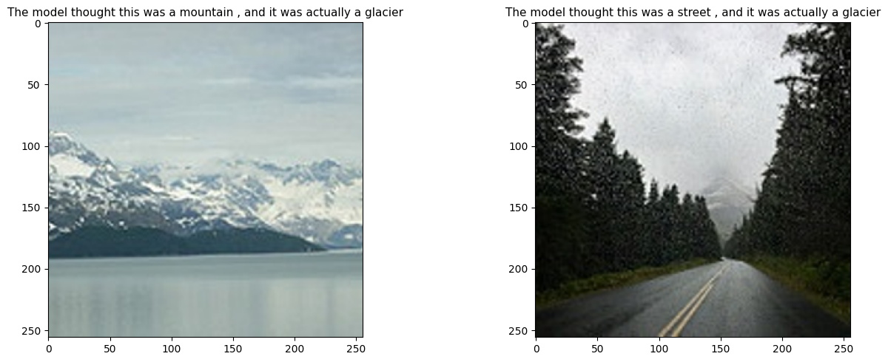
  <p><em>Figure 11: Real Test Inferences Highlighting Ambiguity between Glacier and Mountain Scenes.</em></p>
</div>

#### Scientific Causes:
1. **Geological & Semantic Co-occurrence**: Glaciers naturally reside on mountainous terrain. Snow-capped peaks inherently contain glacial fields, rock faces, and moraines, creating genuine semantic overlap.
2. **Spectral & Color-Space Ambiguity**: Both classes share high-luminance white/cyan snow patches combined with dark rocky scree, causing low-level convolutional color filters to activate similarly.
3. **Annotation Subjectivity**: In many benchmark datasets, an image is labeled "mountain" if peaks are visible, even if a massive glacier occupies the entire foreground.

---

## 🔍 Explainable AI (XAI): Grad-CAM Deep Dive

While standard evaluation gives summary metrics, **Gradient-weighted Class Activation Mapping (Grad-CAM)** explains *why* the model makes a prediction by highlighting salient regions.

<div align="center">
  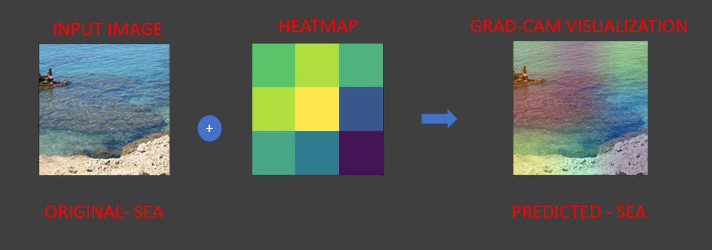
  <p><em>Figure 12: Grad-CAM Architectural Workflow & Gradient Flow Mechanism.</em></p>
</div>

### Grad-CAM Mathematical Formulation

Let $A^k \in \mathbb{R}^{u \times v}$ denote feature map $k$ of the target layer (`res_5_identity_2_c`), and $y^c$ be the model score for target class $c$ before softmax:

1. **Neuron Importance Weights ($\alpha_k^c$)**:
   Gradients of $y^c$ with respect to spatial activation units $A_{ij}^k$ are globally pooled over spatial dimensions $(u, v)$:
   
   $$\alpha_k^c = \frac{1}{u \cdot v} \sum_{i=1}^{u} \sum_{j=1}^{v} \frac{\partial y^c}{\partial A_{ij}^k}$$

<div align="center">
  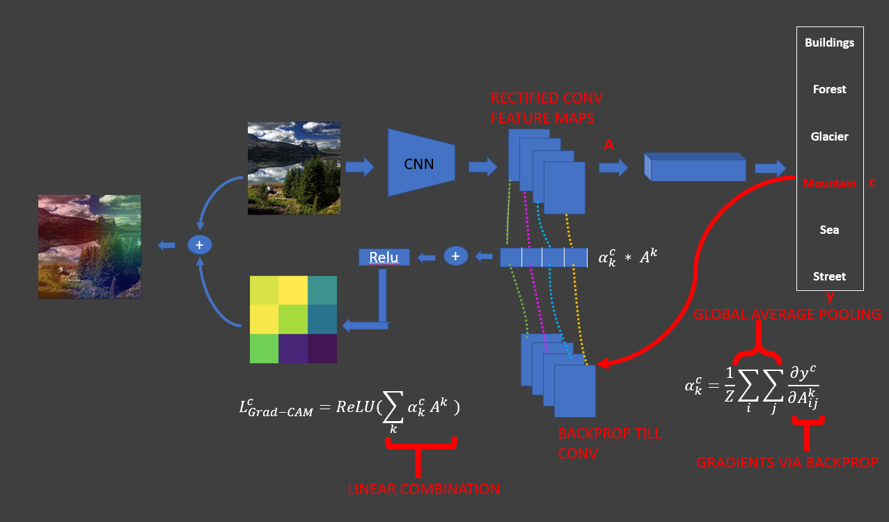
  <p><em>Figure 13: Gradient Backpropagation & Global Average Pooling.</em></p>
</div>

2. **Weighted Linear Combination & ReLU Filtering**:
   Feature maps are weighted by importance $\alpha_k^c$. Applying $\text{ReLU}$ filters out features that negatively correlate with class $c$:
   
   $$L_{\text{Grad-CAM}}^c = \text{ReLU}\left( \sum_{k} \alpha_k^c A^k \right)$$

3. **Bilinear Upsampling & Jet Colormap Overlay**:
   The coarse heatmap is upsampled to input resolution ($256 \times 256$) and superimposed onto the original scene:
   
   $$I_{\text{overlay}} = \beta \cdot I_{\text{RGB}} + (1 - \beta) \cdot \text{colormap}(L_{\text{Grad-CAM}}^c)$$

### Grad-CAM Visual Gallery

Below is the multi-sample interpretability gallery produced across validation scenes:
- **Original Scene**: Input RGB image with ground-truth label.
- **Heatmap**: 2D spatial intensity map of target layer activations.
- **Superimposed Overlay**: Colorized heatmap overlaid onto input image, showing the model's focus during inference.

<div align="center">
  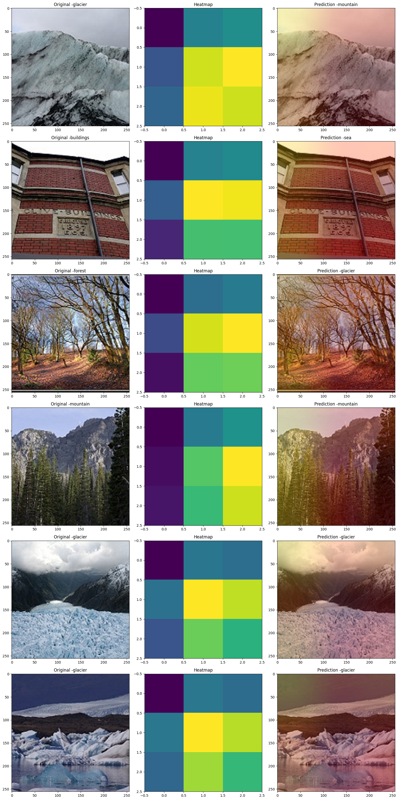
  <p><em>Figure 14: Grad-CAM Activation Heatmaps and Superimposed Overlays Across Test Scenes.</em></p>
</div>

> [!TIP]
> **Interpretability Takeaway**: For **forest**, the model isolates tree canopies; for **sea**, the activation concentrates on water horizons and shorelines; and for **glacier**, gradients concentrate along ice crevasses and frozen surfaces.

---

## 🚢 Production Model Serving (TensorFlow Serving)

For high-throughput, low-latency deployment, the trained ResNet model is packaged for **TensorFlow Serving**:

<div align="center">
  <table>
    <tr>
      <td align="center"><strong>Batch #1 Predictions</strong></td>
      <td align="center"><strong>Batch #2 Predictions</strong></td>
      <td align="center"><strong>Batch #3 Predictions</strong></td>
    </tr>
    <tr>
      <td>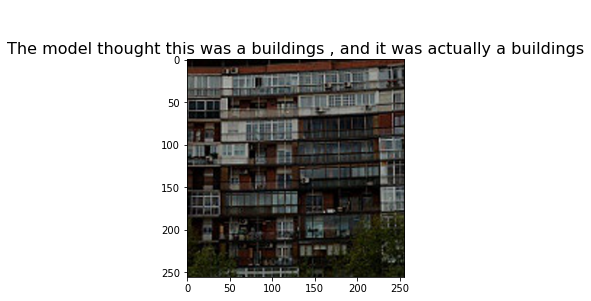</td>
      <td>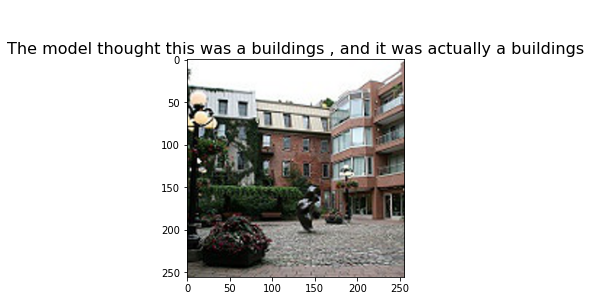</td>
      <td>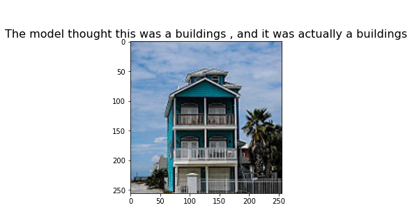</td>
    </tr>
  </table>
  <p><em>Figure 15: Production Batch Inferences Served via TensorFlow Serving Microservice.</em></p>
</div>

---


## ⚡ Quickstart & Installation

### Prerequisites
- Python **3.10**, **3.11**, or **3.12**
- CUDA-compatible GPU (recommended for acceleration)

### Environment Setup via UV / Pip

Using [`uv`](https://github.com/astral-sh/uv) (recommended):
```bash
# Clone the repository
git clone https://github.com/mohd-faizy/22P_Explainable-Scene-Classification-Gradcam.git
cd 22P_Explainable-Scene-Classification-Gradcam

# Create and activate virtual environment
uv venv .venv
# On Windows:
.venv\Scripts\activate
# On Linux/macOS:
source .venv/bin/activate

# Install dependencies
uv pip install -r requirements.txt
```

Alternatively, using standard `pip`:
```bash
python -m venv .venv
source .venv/bin/activate  # or .venv\Scripts\activate on Windows
pip install --upgrade pip
pip install -r requirements.txt
```

### Running the Notebook

Launch JupyterLab:
```bash
jupyter lab scene_classification.ipynb
```

---

## 📚 References & Acknowledgements

1. **ResNet**: He, K., Zhang, X., Ren, S., & Sun, J. (2016). *Deep Residual Learning for Image Recognition*. In [CVPR 2016](https://arxiv.org/abs/1512.03385).
2. **Grad-CAM**: Selvaraju, R. R., Cogswell, M., Das, A., Vedaldi, A., Parikh, D., & Batra, D. (2017). *Grad-CAM: Visual Explanations from Deep Networks via Gradient-based Localization*. In [ICCV 2017](https://arxiv.org/abs/1610.02391).
3. **Intel Image Classification Dataset**: Puneet Bansal / Kaggle. Available on [Kaggle](https://www.kaggle.com/datasets/puneet6060/intel-image-classification).
4. **TensorFlow & Keras**: Abadi et al. (2016). *TensorFlow: A System for Large-Scale Machine Learning*.

---

# License

This repository is licensed under the [MIT License](LICENSE).

---

## 🔗 Connect with me

<div align="center">

[](https://twitter.com/F4izy)
[](https://www.linkedin.com/in/mohd-faizy/)
[](https://ai.stackexchange.com/users/36737/faizy)
[](https://github.com/mohd-faizy)

</div>